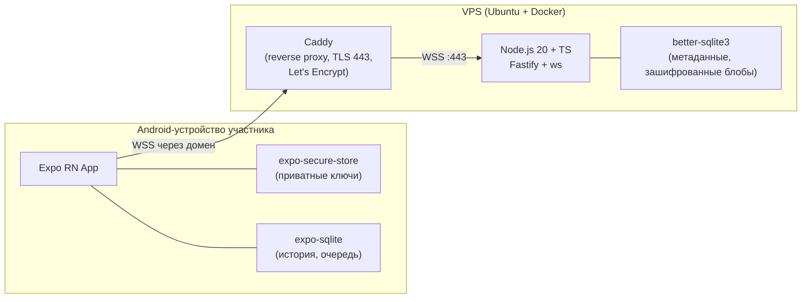
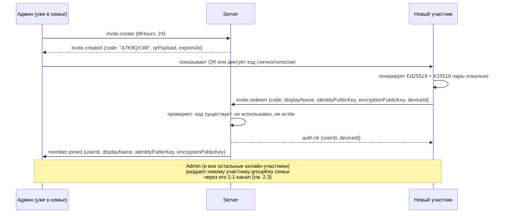

# ARCHITECTURE — семейный мессенджер

Этап 0. Только документ, кода ещё нет. Дальше — Этап 1, после твоего «ок».

## 0. Вводные, зафиксированные для проекта

| Параметр | Значение |
|---|---|
| Участников | до 10 |
| Android-клиенты | Android 13+ |
| Рабочий ПК разработчика | Windows |
| Домен | нет пока — рекомендация ниже |
| VPS | нет пока — рекомендация ниже |

Раз домена и VPS ещё нет, я даю конкретную рекомендацию (не гадание), которую ты либо принимаешь, либо меняешь до Этапа 1:

- **VPS**: Timeweb Cloud или Hetzner Cloud (CX22: 2 vCPU / 4 GB RAM / 40 GB NVMe, ~4-6 €/мес), Ubuntu 22.04 LTS. Для 10 пользователей и текста/фото/голоса этого с запасом хватает. Если сервер должен физически быть в РФ — Timeweb/Selectel; если это не критично — Hetzner (Германия) обычно надёжнее по аптайму и дешевле.
- **Домен**: любой дешёвый в reg.ru / Namecheap / Cloudflare Registrar (~200–900 ₽/год), например `familyname-chat.ru` или `.com`. Домен обязателен не потому что "так положено", а потому что Let's Encrypt/Caddy выпускают сертификат только на реальное доменное имя с DNS, указывающим на VPS. Без покупки домена сразу можно временно взять бесплатный поддомен на DuckDNS (`xxx.duckdns.org`) — Let's Encrypt его тоже примет через HTTP-01, этого достаточно, чтобы дойти до Этапа 1 и проверить всё вживую, а на реальный домен переехать позже (меняется одна строчка в `.env` и Caddyfile).

Эти два пункта не блокируют написание кода — Docker Compose и Caddyfile параметризуются доменом через `.env`, конкретный VPS понадобится физически только при деплое (Этап 1, раздел DEPLOY.md).

## 1. Компоненты



Сервер — только маршрутизатор зашифрованных блобов и хранилище метаданных. Он не хранит и не может прочитать ни одно сообщение: контент шифруется на устройстве отправителя и расшифровывается только на устройствах получателей.

## 2. Модель ключей и шифрование

### 2.1 Какие ключи есть у устройства

При регистрации устройство (не сервер!) генерирует **две независимые пары ключей** через libsodium:

1. **Identity-ключ** — `Ed25519` (`crypto_sign_keypair`). Долгоживущий, служит для:
   - аутентификации устройства на сервере (подпись челленджа при коннекте, без паролей);
   - отображения как **fingerprint** на экране «Семья» (сверка вслух, защита от MITM).
2. **Encryption-ключ** — `X25519` (`crypto_box_keypair`). Служит только для согласования общих секретов (ECDH) между парами устройств.

Разделение специально: подписывающий и Diffie-Hellman ключ — разные примитивы, это стандартная практика (не мешаем ролям ключей).

Приватные части обеих пар лежат **только** в `expo-secure-store` (Android Keystore под капотом), никогда не покидают устройство и не отправляются на сервер.

### 2.2 Схема для 1:1-чата (в т.ч. пары "я-я" не бывает, только между разными людьми)

1. Оба устройства уже знают публичный `X25519`-ключ друг друга (сервер разослал их при регистрации/входе всех участников).
2. Общий секрет: `crypto_box_beforenm(their_pub, my_priv)` → 32-байтовый shared key (алгоритм X25519 + HSalsa20 внутри libsodium `crypto_box`).
3. Каждое сообщение шифруется `crypto_aead_xchacha20poly1305_ietf_encrypt` с этим shared key и **новым случайным 24-байтовым nonce** на каждое сообщение (генерируется `randombytes_buf`, не счётчик — при 10 участниках и низкой частоте сообщений риск коллизии случайного 192-битного nonce пренебрежимо мал, поэтому пары nonce-переиспользование не про нас).
4. AEAD даёт заодно и аутентификацию содержимого (Poly1305 tag) — получатель узнает, если блоб подменили.

### 2.3 Схема для группового чата «Семья»

1. Симметричный ключ группы `groupKey` (32 случайных байта) генерирует и хранит только тот, кто последним его "владеет" (изначально — админ при создании группы).
2. Чтобы раздать ключ N участникам, отправитель шифрует `groupKey` персонально для каждого через их 1:1-канал (см. 2.2) — то есть N отдельных `crypto_box`-блобов, каждый адресован ровно одному устройству.
3. Сообщения в группу шифруются один раз `groupKey` + свежий nonce (`crypto_aead_xchacha20poly1305_ietf`) и рассылаются сервером всем участникам группы как один и тот же ciphertext.
4. **Ротация ключа** — генерируется новый `groupKey` и раздаётся заново (шаг 2) при: добавлении нового участника, ревокации устройства/удалении участника. Старые сообщения расшифровываются старым ключом (клиент хранит историю ключей группы локально, по версии `keyVersion`), новые — новым. Участник, потерявший доступ, не получает новый `groupKey`, поэтому не сможет читать сообщения после ротации.

### 2.4 MVP-упрощение: одно активное устройство на участника

Схема поддерживает много устройств на пользователя (каждое устройство — свой X25519-ключ), но раздача `groupKey` на N устройств каждого из 10 участников кратно увеличивает сложность рассылки. Для MVP: **один активный девайс на человека**; повторная регистрация того же участника с нового телефона автоматически ревокирует прошлое устройство (и запускает ротацию группового ключа). Мультиустройство — в план "что добавить позже".

### 2.5 Честно: чего эта схема НЕ даёт

- **Нет forward secrecy (Double Ratchet, как в Signal/WhatsApp).** Наш shared key для пары устройств статичен (пока оба ключа не меняются) — компрометация приватного `X25519`-ключа одного устройства в любой момент времени раскрывает **всю** переписку этой пары, прошлую и будущую, пока ключ не будет заменён вручную (переустановка).
- **Нет post-compromise security** — после компрометации канал не "самовосстанавливается" без ручной смены ключей всех сторон.
- **Нет deniability** (свойство Off-the-Record) — сообщения криптографически привязаны к identity-ключу отправителя.
- **Групповой ключ статичен между ротациями** — если устройство скомпрометировано, а ротации ещё не было, злоумышленник читает весь групповой трафик за этот период.
- **Метаданные не защищены полным hiding**: сервер видит, кто с кем и когда обменивается сообщениями (размер, время, отправитель/получатель), просто не видит содержимое.

**Что можно добавить позже** (не в MVP, осознанно):
- Double Ratchet / X3DH (протокол Signal, есть готовая библиотека `libsignal-client` с TS-биндингами) — даёт forward secrecy и post-compromise security для 1:1. Для группы — Sender Keys (как в Signal/WhatsApp) поверх ratchet-каналов.
- Периодическая автоматическая ротация ключей по таймеру, а не только по событиям состава.
- Sealed sender / скрытие метаданных отправителя от сервера.
- Полноценное мультиустройство с device-linking (как WhatsApp Web).

Для семьи из 10 доверенных людей на одном устройстве каждый — риск от отсутствия forward secrecy минимален (главная угроза — кража/потеря телефона, а не длительное скрытое присутствие атакующего в канале), поэтому это осознанный компромисс сложности/времени разработки, а не недосмотр.

## 3. Регистрация и инвайты



Код инвайта: 8 символов из алфавита без похожих букв (`ABCDEFGHJKLMNPQRSTUVWXYZ23456789`, без `0/O/1/I`), TTL 24 часа, одноразовый — помечается `used_at` сразу при первом успешном redeem, повторное использование отклоняется.

## 4. Протокол WebSocket

Единый конверт для всех пакетов в обе стороны:

```jsonc
{
  "v": 1,                // версия протокола
  "type": "msg.send",    // тип пакета, список ниже
  "id": "c3f0b6d2-...",  // uuid пакета, для сопоставления запрос/ответ
  "ts": 1732900000000,   // unix ms, время отправки клиентом/сервером
  "payload": { }         // тело, зависит от type
}
```

### 4.1 Аутентификация (client ⇄ server)

```jsonc
// server -> client, сразу после установления соединения
{ "type": "auth.challenge", "payload": { "nonce": "base64(32 random bytes)" } }

// client -> server
{
  "type": "auth.response",
  "payload": {
    "deviceId": "uuid",
    "signature": "base64(crypto_sign_detached(nonce, identityPrivateKey))"
  }
}

// server -> client (успех)
{ "type": "auth.ok", "payload": { "userId": "uuid", "deviceId": "uuid", "serverTime": 1732900000000 } }

// server -> client (провал)
{ "type": "auth.error", "payload": { "code": "UNKNOWN_DEVICE" | "BAD_SIGNATURE" | "REVOKED", "message": "string" } }
```

### 4.2 Инвайты

```jsonc
// client -> server (только от уже авторизованного админ-устройства)
{ "type": "invite.create", "payload": { "ttlHours": 24 } }

// server -> client
{
  "type": "invite.created",
  "payload": { "code": "A7K9QX3M", "qrPayload": "familymsg://invite/A7K9QX3M", "expiresAt": 1733000000000 }
}

// client -> server (от нового, ещё неавторизованного устройства)
{
  "type": "invite.redeem",
  "payload": {
    "code": "A7K9QX3M",
    "deviceId": "uuid",
    "displayName": "Дима",
    "identityPublicKey": "base64",
    "encryptionPublicKey": "base64"
  }
}

// server -> client
{ "type": "invite.redeem.ok", "payload": { "userId": "uuid" } }
{ "type": "invite.redeem.error", "payload": { "code": "EXPIRED" | "USED" | "NOT_FOUND", "message": "string" } }

// server -> все остальные онлайн-устройства, broadcast
{
  "type": "member.joined",
  "payload": {
    "userId": "uuid", "deviceId": "uuid", "displayName": "Дима",
    "identityPublicKey": "base64", "encryptionPublicKey": "base64", "joinedAt": 1732900000000
  }
}
```

### 4.3 Сообщения

```jsonc
// client -> server
{
  "type": "msg.send",
  "payload": {
    "clientMsgId": "uuid",             // генерируется клиентом, для идемпотентности при ретраях
    "chatId": "dm:userA:userB" ,       // или "group:family"
    "contentType": "text" | "image" | "voice" | "file" | "location" | "pin_item" | "pin_item_done",
    "ciphertext": "base64",
    "nonce": "base64",
    "replyTo": "uuid | null",
    "ttlSec": 1209600                  // 14 дней по умолчанию
  }
}

// server -> получателям (1:1 — одному устройству, group — всем устройствам участников группы)
{
  "type": "msg.deliver",
  "payload": {
    "msgId": "uuid",                   // серверный id (может совпадать с clientMsgId)
    "chatId": "dm:userA:userB",
    "fromUserId": "uuid",
    "fromDeviceId": "uuid",
    "contentType": "text",
    "ciphertext": "base64",
    "nonce": "base64",
    "replyTo": "uuid | null",
    "ts": 1732900000000,
    "ttlExpiresAt": 1734109000000
  }
}

// server -> client, подтверждение приёма сервером (не путать с доставкой получателю)
{ "type": "msg.accepted", "payload": { "clientMsgId": "uuid", "msgId": "uuid" } }

// client -> server, статусы доставки/прочтения (генерируются устройством-получателем)
{ "type": "msg.ack", "payload": { "msgId": "uuid", "chatId": "string", "status": "delivered" | "read" } }

// server -> отправителю, релей статуса
{ "type": "msg.ackRelay", "payload": { "msgId": "uuid", "chatId": "string", "byUserId": "uuid", "status": "delivered" | "read", "ts": 1732900000000 } }

// client -> server
{ "type": "typing", "payload": { "chatId": "string", "isTyping": true } }
// server -> релей остальным участникам чата
{ "type": "typing.relay", "payload": { "chatId": "string", "fromUserId": "uuid", "isTyping": true } }

// client -> server, удаление у всех (не просто у себя)
{ "type": "msg.delete", "payload": { "msgId": "uuid", "chatId": "string" } }
// server -> всем участникам чата
{ "type": "msg.deleted", "payload": { "msgId": "uuid", "chatId": "string", "byUserId": "uuid" } }
```

### 4.4 История и синхронизация после реконнекта

```jsonc
// client -> server, курсор — msgId последнего известного сообщения в чате либо null
{ "type": "history.fetch", "payload": { "chatId": "string", "sinceTs": 1732800000000, "cursor": "uuid | null", "limit": 100 } }

// server -> client
{
  "type": "history.page",
  "payload": {
    "chatId": "string",
    "messages": [ /* msg.deliver-подобные объекты */ ],
    "nextCursor": "uuid | null"       // null = это последняя страница
  }
}
```

При реконнекте клиент шлёт `history.fetch` для каждого известного чата с `sinceTs` = время последнего полученного сообщения этого чата; сервер отдаёт всё, что клиент мог пропустить, пока был офлайн (в пределах TTL 14 дней — то, что уже удалено с сервера после полной доставки всем или по истечении TTL, восстановить нельзя, но оно уже есть в локальной БД доставленных устройств).

### 4.5 Ключи группы

```jsonc
// client -> server, рассылка нового groupKey всем участникам после ротации
{
  "type": "keys.rotateGroup",
  "payload": {
    "chatId": "group:family",
    "keyVersion": 3,
    "distributions": [
      { "toUserId": "uuid", "toDeviceId": "uuid", "ciphertext": "base64", "nonce": "base64" }
    ]
  }
}

// server -> каждому адресату персонально
{
  "type": "keys.groupDistribution",
  "payload": {
    "chatId": "group:family", "fromUserId": "uuid", "keyVersion": 3,
    "ciphertext": "base64", "nonce": "base64"
  }
}
```

### 4.6 Устройства и ревокация

```jsonc
// client -> server (админ или сам владелец устройства)
{ "type": "device.revoke", "payload": { "deviceId": "uuid" } }

// server -> broadcast всем
{ "type": "device.revoked", "payload": { "deviceId": "uuid", "userId": "uuid", "revokedAt": 1732900000000 } }
```

### 4.7 Служебные

```jsonc
{ "type": "ping", "payload": {} }
{ "type": "pong", "payload": {} }
{ "type": "error", "payload": { "code": "string", "message": "string" } }
```

## 5. Модель данных сервера (SQLite, `better-sqlite3`)

```sql
CREATE TABLE users (
  id            TEXT PRIMARY KEY,      -- uuid
  display_name  TEXT NOT NULL,
  created_at    INTEGER NOT NULL
);

CREATE TABLE devices (
  id                    TEXT PRIMARY KEY,   -- uuid, задаётся клиентом при регистрации
  user_id               TEXT NOT NULL REFERENCES users(id),
  identity_public_key   TEXT NOT NULL,      -- base64, Ed25519, для аутентификации и fingerprint
  encryption_public_key TEXT NOT NULL,      -- base64, X25519, для маршрутизации (сервер не шифрует, но пересылает клиентам)
  created_at            INTEGER NOT NULL,
  revoked_at            INTEGER            -- NULL = активно
);

CREATE TABLE invites (
  code        TEXT PRIMARY KEY,     -- 8 символов
  created_by  TEXT NOT NULL REFERENCES users(id),
  created_at  INTEGER NOT NULL,
  expires_at  INTEGER NOT NULL,
  used_at     INTEGER,              -- NULL = ещё не использован
  used_by     TEXT REFERENCES users(id)
);

-- Зашифрованные блобы. Сервер хранит только то, что нужно для маршрутизации/TTL.
CREATE TABLE messages (
  id              TEXT PRIMARY KEY,     -- uuid, серверный msgId
  client_msg_id   TEXT NOT NULL,        -- для идемпотентности повторной отправки
  chat_id         TEXT NOT NULL,        -- "dm:userA:userB" | "group:family"
  from_user_id    TEXT NOT NULL REFERENCES users(id),
  from_device_id  TEXT NOT NULL REFERENCES devices(id),
  content_type    TEXT NOT NULL,
  ciphertext      BLOB NOT NULL,
  nonce           BLOB NOT NULL,
  reply_to        TEXT,
  created_at      INTEGER NOT NULL,
  ttl_expires_at  INTEGER NOT NULL,
  deleted_at      INTEGER               -- NULL = не удалено; msg.delete проставляет
);

-- Кто из получателей уже получил/прочитал — по этой таблице решаем,
-- когда можно физически удалить строку из messages (доставлено ВСЕМ получателям чата).
CREATE TABLE message_receipts (
  msg_id      TEXT NOT NULL REFERENCES messages(id),
  user_id     TEXT NOT NULL REFERENCES users(id),
  status      TEXT NOT NULL,   -- 'delivered' | 'read'
  updated_at  INTEGER NOT NULL,
  PRIMARY KEY (msg_id, user_id)
);

CREATE TABLE group_key_versions (
  chat_id       TEXT NOT NULL,
  key_version   INTEGER NOT NULL,
  created_by    TEXT NOT NULL REFERENCES users(id),
  created_at    INTEGER NOT NULL,
  PRIMARY KEY (chat_id, key_version)
);
```

Фоновая задача (раз в час, крон внутри самого Node-процесса): удаляет из `messages` записи, у которых `deleted_at IS NOT NULL`, либо `ttl_expires_at < now()`, либо доставлено (по `message_receipts`) всем активным участникам чата. Логи сервера (Fastify pino) пишут только метаданные (`chatId`, `msgId`, `fromUserId`, размер блоба, статусы) — тело `ciphertext` и уж тем более расшифрованный контент в лог никогда не попадает.

## 6. Модель данных клиента (`expo-sqlite`)

```sql
CREATE TABLE contacts (
  user_id               TEXT PRIMARY KEY,
  display_name          TEXT NOT NULL,
  identity_public_key   TEXT NOT NULL,
  encryption_public_key TEXT NOT NULL,
  fingerprint           TEXT NOT NULL,   -- человекочитаемый хэш identity_public_key для сверки вслух
  is_revoked            INTEGER NOT NULL DEFAULT 0
);

CREATE TABLE messages (
  id              TEXT PRIMARY KEY,      -- совпадает с серверным msgId после подтверждения
  client_msg_id   TEXT NOT NULL UNIQUE,
  chat_id         TEXT NOT NULL,
  from_user_id    TEXT NOT NULL,
  content_type    TEXT NOT NULL,
  plaintext       TEXT,                  -- расшифрованное содержимое (или локальный путь к файлу для медиа)
  reply_to        TEXT,
  status          TEXT NOT NULL,         -- 'pending' | 'sent' | 'delivered' | 'read' | 'failed'
  created_at      INTEGER NOT NULL,
  deleted_at      INTEGER
);

CREATE TABLE outbox (
  client_msg_id  TEXT PRIMARY KEY,
  payload_json   TEXT NOT NULL,          -- готовый msg.send пакет, ждёт соединения
  attempts       INTEGER NOT NULL DEFAULT 0,
  created_at     INTEGER NOT NULL
);

CREATE TABLE group_keys (
  chat_id       TEXT NOT NULL,
  key_version   INTEGER NOT NULL,
  key_material  TEXT NOT NULL,           -- хранится тоже в expo-secure-store, здесь — только ссылка/версия
  PRIMARY KEY (chat_id, key_version)
);

CREATE TABLE pinned_list (
  item_id     TEXT PRIMARY KEY,
  text        TEXT NOT NULL,
  is_done     INTEGER NOT NULL DEFAULT 0,
  updated_at  INTEGER NOT NULL
);
```

`outbox` — это и есть очередь неотправленных сообщений: при отправке пишем сразу в `outbox` + `messages(status='pending')`, при подтверждении сервера (`msg.accepted`) удаляем из `outbox`. Реконнект с экспоненциальной задержкой (1s → 2s → 4s → ... → cap 30s) при восстановлении соединения сначала выгребает `outbox` целиком, потом шлёт `history.fetch` по всем чатам.

Закреплённый список «покупки/напоминания» технически — обычный чат (`chat_id = "pinned:family"`) с типами сообщений `pin_item`/`pin_item_done`, реплицируется тем же протоколом, что и остальные сообщения — отдельного API для него не нужно.

## 7. Push-уведомления — компромисс

FCM ненадёжен в РФ → нельзя делать его единственным каналом. План:

1. **Основной канал**: постоянное WebSocket-соединение внутри foreground service (`expo-notifications` + `expo-task-manager`), с постоянным уведомлением «Мессенджер активен». Работает пока приложение не убито системой — самый надёжный вариант, но требует держать процесс в памяти и разрешение «без ограничений по батарее» от пользователя (на Android 13+ иначе агрессивные OEM-оболочки, Xiaomi/Huawei-style, будут убивать процесс).
2. **Второй канал (опционально)**: self-hosted `ntfy` на том же VPS — лёгкий (отдельный контейнер в том же docker-compose), не зависит от Google, будит устройство отдельным push-каналом (UnifiedPush-совместимо), если foreground service всё же был убит системой.

Компромисс по батарее: постоянный foreground service — это постоянное расходование заряда (WebSocket keepalive пингуется каждые ~30-60 сек). Для 10 близких пользователей на телефонах, которые в основном заряжаются раз в день, это приемлемо и предсказуемо; альтернатива (полагаться только на FCM) в текущих условиях РФ означает нестабильную доставку уведомлений, что хуже для мессенджера, где важна оперативность.

## 8. Роли и права

Один выделенный **админ** (тот, кто изначально поднял сервер) может: создавать инвайты, ревокировать устройства. Остальные участники — обычные, могут только переписываться и один раз (Этап 5) — ревокировать собственное потерянное устройство сами, если у них есть доступ к другому активному устройству (в MVP при одном устройстве на человека это делает только админ по просьбе).

---

Это весь Этап 0. Жду «ок» — после него перехожу к Этапу 1 (монорепо, сервер-эхо с аутентификацией, docker compose + Caddy, docs/DEPLOY.md).
