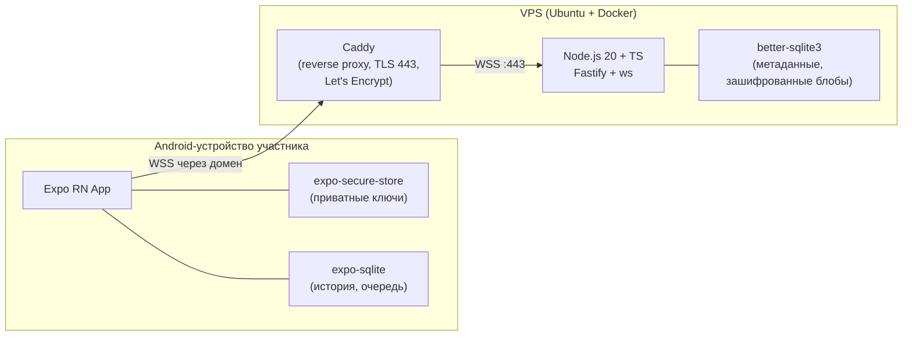
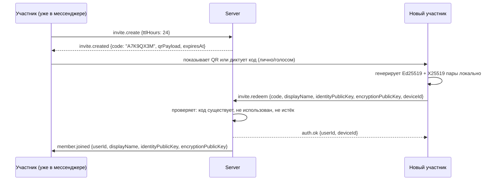

# ARCHITECTURE — приватный мессенджер Cry

Документ отражает текущее состояние реализации.

## 0. Вводные, зафиксированные для проекта

| Параметр | Значение |
|---|---|
| Участников | до 10 |
| Android-клиенты | Android 13+ |
| Рабочий ПК разработчика | Windows |
| Домен | нет пока — рекомендация ниже |
| VPS | нет пока — рекомендация ниже |

Раз домена и VPS ещё нет, я даю конкретную рекомендацию (не гадание), которую ты либо принимаешь, либо меняешь до Этапа 1:

- **VPS**: Timeweb Cloud или Hetzner Cloud (CX22: 2 vCPU / 4 GB RAM / 40 GB NVMe, ~4-6 €/мес), Ubuntu 22.04 LTS. Для 10 пользователей и текста/фото/голоса этого с запасом хватает. Если сервер должен физически быть в РФ — Timeweb/Selectel; если это не критично — Hetzner (Германия) обычно надёжнее по аптайму и дешевле.
- **Домен**: любой дешёвый в reg.ru / Namecheap / Cloudflare Registrar (~200–900 ₽/год), например `familyname-chat.ru` или `.com`. Домен обязателен не потому что "так положено", а потому что Let's Encrypt/Caddy выпускают сертификат только на реальное доменное имя с DNS, указывающим на VPS. Без покупки домена сразу можно временно взять бесплатный поддомен на DuckDNS (`xxx.duckdns.org`) — Let's Encrypt его тоже примет через HTTP-01, этого достаточно, чтобы дойти до Этапа 1 и проверить всё вживую, а на реальный домен переехать позже (меняется одна строчка в `.env` и Caddyfile).

Эти два пункта не блокируют написание кода — Docker Compose и Caddyfile параметризуются доменом через `.env`, конкретный VPS понадобится физически только при деплое (Этап 1, раздел DEPLOY.md).

## 1. Компоненты



Только личные чаты 1:1. Сервер — только маршрутизатор зашифрованных блобов и хранилище метаданных. Он не хранит и не может прочитать ни одно сообщение: контент шифруется на устройстве отправителя и расшифровывается только на устройствах получателей.

## 2. Модель ключей и шифрование

### 2.1 Какие ключи есть у устройства

При регистрации устройство (не сервер!) генерирует **две независимые пары ключей** через libsodium:

1. **Identity-ключ** — `Ed25519` (`crypto_sign_keypair`). Долгоживущий, служит для:
   - аутентификации устройства на сервере (подпись челленджа при коннекте, без паролей);
   - отображения как **fingerprint** в настройках и в карточке контакта (сверка вслух, защита от MITM).
2. **Encryption-ключ** — `X25519` (`crypto_box_keypair`). Служит только для согласования общих секретов (ECDH) между парами устройств.

Разделение специально: подписывающий и Diffie-Hellman ключ — разные примитивы, это стандартная практика (не мешаем ролям ключей).

Приватные части обеих пар лежат **только** в `expo-secure-store` (Android Keystore под капотом), никогда не покидают устройство и не отправляются на сервер.

### 2.2 Схема для личного чата 1:1

1. Оба устройства знают публичный `X25519`-ключ друг друга (сервер рассылает их в списке участников при подключении).
2. Сообщение шифруется `crypto_box_easy(plaintext, nonce, their_public_key, my_secret_key)` — это NaCl box: X25519-ECDH + XSalsa20-Poly1305 «под капотом», общий секрет выводится внутри вызова.
3. Nonce — **новый случайный 24-байтовый** на каждое сообщение (`randombytes_buf`), не счётчик: при десяти участниках и низкой частоте сообщений риск коллизии 192-битного случайного значения пренебрежимо мал.
4. Тег Poly1305 внутри box даёт аутентификацию содержимого — получатель заметит подмену шифротекста или nonce.
5. Ключ пары симметричен: `(their_pub, my_sec)` даёт тот же секрет, что `(my_pub, their_sec)`. Поэтому автор расшифровывает и свои сообщения, пришедшие обратно из истории (например, после переустановки).

**Почему именно `crypto_box_easy`, а не вывод ключа + AEAD отдельно.** Первая
версия использовала `crypto_box_beforenm` для общего ключа и затем
`XChaCha20-Poly1305`. На устройстве это молча падало: `react-native-libsodium`
реализует лишь часть API `libsodium-wrappers`, и `crypto_box_beforenm` в ней
нет — а тесты в Node проходили, потому что там полная сборка libsodium.
Теперь пакет использует только примитивы, доступные в обеих сборках.

**Та же ловушка второй раз: `from_string`.** Даже после перехода на
`crypto_box_easy` отправка не работала, потому что в нативной сборке
`react-native-libsodium` нет и функции `from_string` (перевод строки в байты
UTF-8) — она есть только в web-варианте модуля, который проксирует
`libsodium-wrappers`. Поэтому UTF-8 в обе стороны считает свой код
(`packages/crypto/src/utf8.ts`): `TextEncoder`/`TextDecoder` используются, если
есть, а в React Native 0.86 их нет, и работает своя реализация, сверенная с
эталоном на всём BMP.

**Как это больше не повторится.** Список доступного на устройстве больше не
пишется руками — он читается прямо из
`react-native-libsodium/lib/commonjs/lib.native.js` (тест
`совместимость с react-native-libsodium`). Тест проверяет двумя способами: что
`createCrypto` не обращается ни к чему за пределами этого списка, и что
шифрование работает на sodium, урезанном ровно до него. Рукописный список я
составил неверно дважды — оба раза при зелёных тестах в Node.

### 2.3 Групповых чатов нет

В системе только личные диалоги 1:1 (`chatId` вида `dm:<userA>:<userB>`).
Групповой чат был убран осознанно: он требует общего симметричного ключа с
ротацией при каждом изменении состава, а это и лишний код, и заметно более
слабая гарантия (участник, у которого утёк ключ, читает весь групповой
трафик до ближайшей ротации). Для десяти человек набор личных переписок
покрывает задачу и остаётся строго парным: у каждой пары свой независимый
ключ, компрометация одного устройства не раскрывает переписку остальных
между собой.

### 2.4 MVP-упрощение: одно активное устройство на участника

Схема поддерживает много устройств на пользователя (каждое устройство — свой X25519-ключ), но тогда каждое сообщение нужно шифровать отдельно под каждое устройство собеседника. Для MVP: **один активный девайс на человека**; повторная регистрация того же участника с нового телефона ревокирует прошлое устройство. Мультиустройство — в план "что добавить позже".

### 2.5 Честно: чего эта схема НЕ даёт

- **Нет forward secrecy (Double Ratchet, как в Signal/WhatsApp).** Наш shared key для пары устройств статичен (пока оба ключа не меняются) — компрометация приватного `X25519`-ключа одного устройства в любой момент времени раскрывает **всю** переписку этой пары, прошлую и будущую, пока ключ не будет заменён вручную (переустановка).
- **Нет post-compromise security** — после компрометации канал не "самовосстанавливается" без ручной смены ключей всех сторон.
- **Нет deniability** (свойство Off-the-Record) — сообщения криптографически привязаны к identity-ключу отправителя.
- **Метаданные не защищены полным hiding**: сервер видит, кто с кем и когда обменивается сообщениями (размер, время, отправитель/получатель), просто не видит содержимое.
- **Нет бэкапа и восстановления.** Приватные ключи лежат только в `expo-secure-store` (Android Keystore) на самом телефоне: их нельзя ни скопировать оттуда, ни выгрузить. Значит переустановка приложения (или установка APK с другой подписью, что требует удаления старого — см. docs/BUILD.md §0) уносит и ключи, и локальную переписку безвозвратно: на сервере лежат только зашифрованные блобы, а расшифровать их больше нечем. Человек после этого регистрируется новым кодом и становится **новым** участником с новым `userId`; прежнего убирает главный. Это прямое следствие «сервер не видит содержимое»: любой бэкап, который сервер мог бы восстановить, означал бы, что ключи покидают телефон.

**Что можно добавить позже** (не в MVP, осознанно):
- Double Ratchet / X3DH (протокол Signal, есть готовая библиотека `libsignal-client` с TS-биндингами) — даёт forward secrecy и post-compromise security для личных чатов.
- Периодическая автоматическая ротация ключей по таймеру.
- Sealed sender / скрытие метаданных отправителя от сервера.
- Полноценное мультиустройство с device-linking (как WhatsApp Web).

Для семьи из 10 доверенных людей на одном устройстве каждый — риск от отсутствия forward secrecy минимален (главная угроза — кража/потеря телефона, а не длительное скрытое присутствие атакующего в канале), поэтому это осознанный компромисс сложности/времени разработки, а не недосмотр.

## 3. Регистрация и инвайты



Код инвайта: 8 символов из алфавита без похожих букв (`ABCDEFGHJKLMNPQRSTUVWXYZ23456789`, без `0/O/1/I`), TTL 24 часа, одноразовый — помечается `used_at` сразу при первом успешном redeem, повторное использование отклоняется.

## 4. Протокол WebSocket

Единый конверт для всех пакетов в обе стороны:

```jsonc
{
  "v": 1,                // версия протокола
  "type": "msg.send",    // тип пакета, список ниже
  "id": "c3f0b6d2-...",  // uuid пакета, для сопоставления запрос/ответ
  "ts": 1732900000000,   // unix ms, время отправки клиентом/сервером
  "payload": { }         // тело, зависит от type
}
```

**Кодировка бинарных полей.** Всё бинарное (`nonce`, `ciphertext`, публичные ключи,
подписи) едет строкой base64. Клиент кодирует и декодирует через libsodium, а тот по
умолчанию работает в варианте **URLSAFE_NO_PADDING** (`-` и `_` вместо `+` и `/`, без
`=`) и на обычном base64 бросает исключение. Поэтому сервер, отдавая шифротекст из
базы (он лежит там блобом), кодирует его именно как `base64url`. Клиент дополнительно
приводит любую входящую строку к этому варианту, чтобы работать и со старой версией
сервера.

### 4.1 Аутентификация (client ⇄ server)

```jsonc
// server -> client, сразу после установления соединения
{ "type": "auth.challenge", "payload": { "nonce": "base64(32 random bytes)" } }

// client -> server
{
  "type": "auth.response",
  "payload": {
    "deviceId": "uuid",
    "signature": "base64(crypto_sign_detached(nonce, identityPrivateKey))"
  }
}

// server -> client (успех)
{ "type": "auth.ok", "payload": { "userId": "uuid", "deviceId": "uuid", "serverTime": 1732900000000 } }

// server -> client (провал)
{ "type": "auth.error", "payload": { "code": "UNKNOWN_DEVICE" | "BAD_SIGNATURE" | "REVOKED", "message": "string" } }
```

### 4.2 Инвайты

```jsonc
// client -> server (только от уже авторизованного админ-устройства)
{ "type": "invite.create", "payload": { "ttlHours": 24 } }

// server -> client
{
  "type": "invite.created",
  "payload": { "code": "A7K9QX3M", "qrPayload": "familymsg://invite/A7K9QX3M", "expiresAt": 1733000000000 }
}

// client -> server (от нового, ещё неавторизованного устройства)
{
  "type": "invite.redeem",
  "payload": {
    "code": "A7K9QX3M",
    "deviceId": "uuid",
    "displayName": "Дима",
    "identityPublicKey": "base64",
    "encryptionPublicKey": "base64"
  }
}

// server -> client
{ "type": "invite.redeem.ok", "payload": { "userId": "uuid" } }
{ "type": "invite.redeem.error", "payload": { "code": "EXPIRED" | "USED" | "NOT_FOUND", "message": "string" } }

// server -> все остальные онлайн-устройства, broadcast
{
  "type": "member.joined",
  "payload": {
    "userId": "uuid", "deviceId": "uuid", "displayName": "Дима",
    "identityPublicKey": "base64", "encryptionPublicKey": "base64", "joinedAt": 1732900000000
  }
}
```

`member.joined` доходит только до устройств, которые в этот момент онлайн. Устройство,
которое было офлайн и не видело этого broadcast, узнаёт о новом составе семьи иначе — см. 4.8.

### 4.3 Список участников при подключении

Сразу после `auth.ok` **или** `invite.redeem.ok` сервер присылает тому же
устройству полный снимок активных участников — то, ради чего иначе устройство
после длительного оффлайна осталось бы с неполным списком контактов:

```jsonc
// server -> только что аутентифицированному/зарегистрированному устройству
{
  "type": "roster.snapshot",
  "payload": {
    "members": [
      {
        "userId": "uuid", "deviceId": "uuid", "displayName": "Дима",
        "identityPublicKey": "base64", "encryptionPublicKey": "base64", "joinedAt": 1732900000000
      }
    ]
  }
}
```

Список включает всех, кроме самого получателя, отсортирован по времени
регистрации. Клиент на основании этого списка (не дожидаясь `member.joined`)
строит/обновляет локальную таблицу `contacts` — и заводит по личному чату на
каждого участника.

### 4.4 Сообщения

```jsonc
// client -> server
{
  "type": "msg.send",
  "payload": {
    "clientMsgId": "uuid",             // генерируется клиентом, для идемпотентности при ретраях
    "chatId": "dm:userA:userB",
    "contentType": "text" | "image" | "voice" | "file" | "location" | "pin_item" | "pin_item_done",
    "ciphertext": "base64",
    "nonce": "base64",
    "replyTo": "uuid | null",
    "ttlSec": 1209600                  // 14 дней по умолчанию
  }
}

// server -> получателю (активному устройству собеседника)
{
  "type": "msg.deliver",
  "payload": {
    "msgId": "uuid",                   // серверный id (может совпадать с clientMsgId)
    "chatId": "dm:userA:userB",
    "fromUserId": "uuid",
    "fromDeviceId": "uuid",
    "contentType": "text",
    "ciphertext": "base64",
    "nonce": "base64",
    "replyTo": "uuid | null",
    "ts": 1732900000000,
    "ttlExpiresAt": 1734109000000
  }
}

// server -> client, подтверждение приёма сервером (не путать с доставкой получателю)
{ "type": "msg.accepted", "payload": { "clientMsgId": "uuid", "msgId": "uuid" } }

// client -> server, статусы доставки/прочтения (генерируются устройством-получателем)
{ "type": "msg.ack", "payload": { "msgId": "uuid", "chatId": "string", "status": "delivered" | "read" } }

// server -> отправителю, релей статуса
{ "type": "msg.ackRelay", "payload": { "msgId": "uuid", "chatId": "string", "byUserId": "uuid", "status": "delivered" | "read", "ts": 1732900000000 } }

// client -> server
{ "type": "typing", "payload": { "chatId": "string", "isTyping": true } }
// server -> релей остальным участникам чата
{ "type": "typing.relay", "payload": { "chatId": "string", "fromUserId": "uuid", "isTyping": true } }

// client -> server, удаление у всех (не просто у себя)
{ "type": "msg.delete", "payload": { "msgId": "uuid", "chatId": "string" } }
// server -> всем участникам чата
{ "type": "msg.deleted", "payload": { "msgId": "uuid", "chatId": "string", "byUserId": "uuid" } }
```

### 4.5 История и синхронизация после реконнекта

```jsonc
// client -> server, курсор — msgId последнего известного сообщения в чате либо null
{ "type": "history.fetch", "payload": { "chatId": "string", "sinceTs": 1732800000000, "cursor": "uuid | null", "limit": 100 } }

// server -> client
{
  "type": "history.page",
  "payload": {
    "chatId": "string",
    "messages": [ /* msg.deliver-подобные объекты */ ],
    "nextCursor": "uuid | null"       // null = это последняя страница
  }
}
```

При реконнекте клиент шлёт `history.fetch` для каждого известного чата с `sinceTs` = время последнего полученного сообщения этого чата; сервер отдаёт всё, что клиент мог пропустить, пока был офлайн (в пределах TTL 14 дней — то, что уже удалено с сервера после полной доставки всем или по истечении TTL, восстановить нельзя, но оно уже есть в локальной БД доставленных устройств).

### 4.6 Устройства и отзыв доступа

Случай, ради которого это есть: телефон потерян или украден. Удаление участника
здесь не подходит — оно уносит переписку с ним у всех и превращает человека в
нового при возвращении. Отзыв отключает одно устройство, обратим и переписку не
трогает.

```jsonc
// client -> server (только главный участник)
{ "type": "device.revoke", "payload": { "deviceId": "uuid", "revoked": true } }

// server -> broadcast всем, включая просившего
{ "type": "member.revoked", "payload": { "userId": "uuid", "deviceId": "uuid", "revoked": true } }
```

Отказы: `NOT_ADMIN`, `NO_SUCH_DEVICE`, `CANNOT_REVOKE_SELF` (иначе главный лишил
бы себя доступа, и вернуть право было бы нечем, кроме командной строки на
сервере), `ALREADY_IN_STATE`.

Что происходит при отзыве:

- запись устройства остаётся, ставится `devices.revoked_at`;
- соединение отозванного устройства разрывается сразу (код 4003) — иначе оно
  продолжало бы получать сообщения до собственного переподключения, а именно от
  этого отзыв и защищает;
- вход тем же устройством отклоняется с `auth.error` кода `REVOKED` (а не
  `UNKNOWN_DEVICE`: для человека это разные сообщения);
- новые сообщения ему не доставляются — `recipientDeviceIds` берёт только
  устройства без `revoked_at`. Сами сообщения в базе сервера лежат, поэтому
  после снятия отзыва они придут через `history.fetch`;
- **отозванное устройство остаётся в `roster.snapshot` с признаком
  `revoked: true`.** Это обязательно: клиент удаляет участников, которых в
  roster нет, вместе с перепиской (§4.3), поэтому скрытие отозванных стирало бы
  переписку с этим человеком у всех остальных. Плюс его открытые ключи нужны,
  чтобы расшифровывать его прежние сообщения.

Клиент помечает такой контакт (`contacts.is_revoked`), убирает строку ввода в
чате и не даёт ему шифровать новое, но переписку показывает как раньше.

Чего отзыв не даёт: если ключи с телефона пропали (переустановка, сброс), то и
после снятия отзыва этим устройством уже не войти — секретные ключи хранятся
только на нём. Тогда человек регистрируется новым кодом, то есть становится
новым участником с новым `userId`.

То же самое умеет командная строка сервера — на случай, когда в приложение не
зайти: `npm run revoke-device` (см. docs/DEPLOY.md §8c).

### 4.7 Служебные

```jsonc
{ "type": "ping", "payload": {} }
{ "type": "pong", "payload": {} }
{ "type": "error", "payload": { "code": "string", "message": "string" } }

// client -> server, смена своего отображаемого имени (1–40 символов)
{ "type": "profile.update", "payload": { "displayName": "string" } }

// server -> broadcast всем, включая автора: имя видят все участники
{ "type": "member.updated", "payload": { "userId": "uuid", "displayName": "string" } }
```

**Идемпотентность отправки.** `msg.send` с уже известным `clientMsgId` — это не
ошибка, а тот же ответ `msg.accepted` (и без повторной рассылки получателям).
Иначе клиент, у которого потерялось подтверждение, не мог убрать сообщение из
своей очереди и пересылал его при каждом переподключении.

**Как клиент держит соединение живым.** `ping` уходит раз в 30 секунд. Если на два
пинга подряд не пришёл `pong`, соединение считается мёртвым и пересоздаётся — на
мобильной сети сокет часто «умирает» без события `close`, оставаясь в состоянии
`OPEN`, и без этой проверки приложение бесконечно висело бы «на связи», не получая
сообщений. Дополнительно соединение пересоздаётся сразу при возврате приложения из
фона (Android рвёт сокеты свёрнутых приложений), при отправке сообщения без связи и по
нажатию на строку статуса в шапке списка чатов. Обычный реконнект — с экспоненциальной
задержкой до 30 секунд.

## 5. Модель данных сервера (SQLite, `better-sqlite3`)

```sql
CREATE TABLE users (
  id            TEXT PRIMARY KEY,      -- uuid
  display_name  TEXT NOT NULL,
  created_at    INTEGER NOT NULL
);

CREATE TABLE devices (
  id                    TEXT PRIMARY KEY,   -- uuid, задаётся клиентом при регистрации
  user_id               TEXT NOT NULL REFERENCES users(id),
  identity_public_key   TEXT NOT NULL,      -- base64, Ed25519, для аутентификации и fingerprint
  encryption_public_key TEXT NOT NULL,      -- base64, X25519, для маршрутизации (сервер не шифрует, но пересылает клиентам)
  created_at            INTEGER NOT NULL,
  revoked_at            INTEGER            -- NULL = активно
);

CREATE TABLE invites (
  code        TEXT PRIMARY KEY,     -- 8 символов
  created_by  TEXT NOT NULL REFERENCES users(id),
  created_at  INTEGER NOT NULL,
  expires_at  INTEGER NOT NULL,
  used_at     INTEGER,              -- NULL = ещё не использован
  used_by     TEXT REFERENCES users(id)
);

-- Зашифрованные блобы. Сервер хранит только то, что нужно для маршрутизации/TTL.
CREATE TABLE messages (
  id              TEXT PRIMARY KEY,     -- uuid, серверный msgId
  client_msg_id   TEXT NOT NULL,        -- для идемпотентности повторной отправки
  chat_id         TEXT NOT NULL,        -- "dm:userA:userB"
  from_user_id    TEXT NOT NULL REFERENCES users(id),
  from_device_id  TEXT NOT NULL REFERENCES devices(id),
  content_type    TEXT NOT NULL,
  ciphertext      BLOB NOT NULL,
  nonce           BLOB NOT NULL,
  reply_to        TEXT,
  created_at      INTEGER NOT NULL,
  ttl_expires_at  INTEGER NOT NULL,
  deleted_at      INTEGER               -- NULL = не удалено; msg.delete проставляет
);

-- Кто из получателей уже получил/прочитал — по этой таблице решаем,
-- когда можно физически удалить строку из messages (доставлено ВСЕМ получателям чата).
CREATE TABLE message_receipts (
  msg_id      TEXT NOT NULL REFERENCES messages(id),
  user_id     TEXT NOT NULL REFERENCES users(id),
  status      TEXT NOT NULL,   -- 'delivered' | 'read'
  updated_at  INTEGER NOT NULL,
  PRIMARY KEY (msg_id, user_id)
);

```

Фоновая задача (раз в час, крон внутри самого Node-процесса): удаляет из `messages` записи, у которых `deleted_at IS NOT NULL`, либо `ttl_expires_at < now()`, либо доставлено (по `message_receipts`) всем активным участникам чата. Логи сервера (Fastify pino) пишут только метаданные (`chatId`, `msgId`, `fromUserId`, размер блоба, статусы) — тело `ciphertext` и уж тем более расшифрованный контент в лог никогда не попадает.

## 6. Модель данных клиента (`expo-sqlite`)

```sql
CREATE TABLE contacts (
  user_id               TEXT PRIMARY KEY,
  display_name          TEXT NOT NULL,
  identity_public_key   TEXT NOT NULL,
  encryption_public_key TEXT NOT NULL,
  fingerprint           TEXT NOT NULL,   -- человекочитаемый хэш identity_public_key для сверки вслух
  is_revoked            INTEGER NOT NULL DEFAULT 0
);

CREATE TABLE messages (
  id              TEXT PRIMARY KEY,      -- совпадает с серверным msgId после подтверждения
  client_msg_id   TEXT NOT NULL UNIQUE,
  chat_id         TEXT NOT NULL,
  from_user_id    TEXT NOT NULL,
  content_type    TEXT NOT NULL,
  plaintext       TEXT,                  -- расшифрованное содержимое (или локальный путь к файлу для медиа)
  reply_to        TEXT,
  status          TEXT NOT NULL,         -- 'pending' | 'sent' | 'delivered' | 'read' | 'failed'
  created_at      INTEGER NOT NULL,
  deleted_at      INTEGER
);

CREATE TABLE outbox (
  client_msg_id  TEXT PRIMARY KEY,
  payload_json   TEXT NOT NULL,          -- готовый msg.send пакет, ждёт соединения
  attempts       INTEGER NOT NULL DEFAULT 0,
  created_at     INTEGER NOT NULL
);

CREATE TABLE pinned_list (
  item_id     TEXT PRIMARY KEY,
  text        TEXT NOT NULL,
  is_done     INTEGER NOT NULL DEFAULT 0,
  updated_at  INTEGER NOT NULL
);
```

`outbox` — это и есть очередь неотправленных сообщений: при отправке пишем сразу в `outbox` + `messages(status='pending')`, при подтверждении сервера (`msg.accepted`) удаляем из `outbox`. Реконнект с экспоненциальной задержкой (1s → 2s → 4s → ... → cap 30s) при восстановлении соединения сначала выгребает `outbox` целиком, потом шлёт `history.fetch` по всем чатам.

Закреплённый список «покупки/напоминания» технически — обычный чат (`chat_id = "pinned:family"`) с типами сообщений `pin_item`/`pin_item_done`, реплицируется тем же протоколом, что и остальные сообщения — отдельного API для него не нужно.

## 7. Push-уведомления — компромисс

**Что сделано.** Уведомления — локальные, не push: содержимое зашифровано, и
расшифровать его может только клиент, поэтому уведомление показывает само
приложение, получив сообщение по своему WebSocket. Сервер о содержимом не знает
и ничего не рассылает — ни Google, ни кто-либо ещё в этой цепочке не участвует.
Уведомления одного чата склеиваются по `chatId` и гаснут, когда чат открыт;
разрешение спрашивается по нажатию переключателя в настройках, а не при старте.

**Чего это НЕ даёт.** Соединение живёт, пока Android не выгрузил процесс: у
свёрнутого приложения это обычно от нескольких минут до нескольких часов. После
выгрузки сообщения появятся при следующем открытии Cry — они не потеряются
(лежат на сервере до 14 дней), но уведомления о них не будет. Чтобы соединение
держалось всегда, нужен foreground service — это отдельный шаг, см. ниже.

FCM ненадёжен в РФ → нельзя делать его единственным каналом. План развития:

1. **Основной канал**: постоянное WebSocket-соединение внутри foreground service (`expo-notifications` + `expo-task-manager`), с постоянным уведомлением «Мессенджер активен». Работает пока приложение не убито системой — самый надёжный вариант, но требует держать процесс в памяти и разрешение «без ограничений по батарее» от пользователя (на Android 13+ иначе агрессивные OEM-оболочки, Xiaomi/Huawei-style, будут убивать процесс).
2. **Второй канал (опционально)**: self-hosted `ntfy` на том же VPS — лёгкий (отдельный контейнер в том же docker-compose), не зависит от Google, будит устройство отдельным push-каналом (UnifiedPush-совместимо), если foreground service всё же был убит системой.

Компромисс по батарее: постоянный foreground service — это постоянное расходование заряда (WebSocket keepalive пингуется каждые ~30-60 сек). Для 10 близких пользователей на телефонах, которые в основном заряжаются раз в день, это приемлемо и предсказуемо; альтернатива (полагаться только на FCM) в текущих условиях РФ означает нестабильную доставку уведомлений, что хуже для мессенджера, где важна оперативность.

## 8. Роли и права

Один выделенный **главный участник** может: удалять участников, отзывать и
возвращать доступ устройств. Остальные — обычные: переписываются и выпускают коды
приглашений (инвайты сознательно доступны всем — иначе добавить человека можно
было бы только через главного).

Право явное — столбец `users.is_admin`. Сначала оно было неявным («первый
зарегистрированный»), и это ломалось: стоило удалить свой же прежний аккаунт,
как права молча уходили к другому человеку. Если флага нет ни у кого (старая
база), правило откатывается к первому по времени регистрации — иначе система
осталась бы без управления.

Право передаётся и снимается из командной строки сервера
(`npm run set-admin`, см. docs/DEPLOY.md §8a). Два запрета не дают запереть себя
снаружи: нельзя снять право у последнего главного и нельзя удалить последнего
главного участника (`LAST_ADMIN`).

Своё устройство главный отозвать не может (`CANNOT_REVOKE_SELF`): он лишил бы
себя доступа, а вернуть его было бы нечем, кроме той же командной строки.
Отозвать собственный потерянный телефон со второго своего устройства нельзя —
в MVP у человека одно активное устройство (§2.4), поэтому это делает главный по
просьбе.

---

Это весь Этап 0. Жду «ок» — после него перехожу к Этапу 1 (монорепо, сервер-эхо с аутентификацией, docker compose + Caddy, docs/DEPLOY.md).

## 12. Работа в фоне (что она даёт и чего не даёт)

Уведомления о сообщениях — локальные: их показывает сам клиент, получив
сообщение по своему WebSocket. Иначе и быть не может, потому что содержимое
зашифровано и расшифровать его способен только клиент; сервер физически не в
состоянии составить текст уведомления.

Из этого следует: уведомления приходят, только пока жив процесс приложения.
Android выгружает свёрнутые приложения, а на прошивках с агрессивной экономией
батареи (Samsung и подобные) — почти сразу после сворачивания. Отсюда типичная
жалоба «уведомления приходят только когда приложение открыто».

Решение — служба переднего плана (`app/modules/keep-alive`, локальный нативный
модуль): пока она работает, Android процесс не выгружает. Ценой постоянного
уведомления в шторке, которое система требует показывать и убрать которое
нельзя.

Чего это **не** даёт:

- **После перезагрузки телефона** служба не поднимается сама — уведомления
  начнут приходить после первого открытия Cry. Автозапуск потребовал бы
  `RECEIVE_BOOT_COMPLETED` и запуска JS без участия человека; сознательно не
  делаем.
- **Если систему всё же заставили убить процесс** (закрытие вручную из
  настроек, крайняя нехватка памяти, «оптимизация» от производителя), служба
  умирает вместе с ним и сама не восстанавливается. Так честнее, чем поднимать
  её без JS: уведомление «на связи» у приложения, которое ничего не получает,
  вводит в заблуждение хуже, чем его отсутствие.
- **Гарантии от прошивки.** Ряд производителей убивает процессы вопреки
  правилам Android. Помогает исключение приложения из экономии батареи —
  в настройках это подсказано текстом.

### «В сети» и «прочитано» при работе в фоне

Со службой переднего плана соединение живёт постоянно, поэтому открытый сокет
перестал что-либо означать: раньше «в сети» вычислялось из наличия соединения, и
этого хватало — свёрнутое приложение Android быстро выгружал. Теперь человек
висел бы «в сети» с телефоном в кармане, а сообщения помечались бы прочитанными,
пока экран погашен.

Поэтому активность клиент сообщает явно (пакет `presence.set`), а «прочитано»
отправляется только когда приложение активно **и** экран включён. Состояние
экрана спрашивается у системы напрямую (`PowerManager.isInteractive`): гашение
экрана не на всех прошивках приходит событием сворачивания приложения. Раз в 15
секунд состояние перепроверяется — опрос дешёвый, а других способов узнать про
экран из JS нет.

«Доставлено» при этом отправляется как раньше: устройство сообщение
действительно получило, и это не зависит от того, смотрит ли человек на экран.

Альтернативы и почему не они: push через FCM потребовал бы Firebase и не
работает надёжно в России (см. §0), а периодическая проверка в фоне
(`expo-background-task`) даёт задержку от 15 минут и тоже отключается
экономией батареи.
